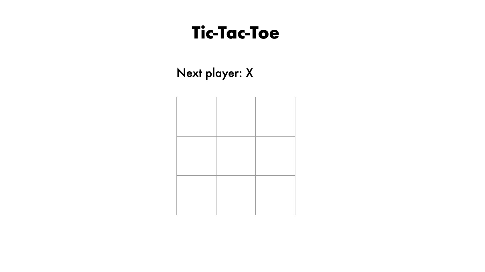

# Tic-tac-toe

I built this simple tic-tac-toe game while following the React tutorial found [here](https://reactjs.org/tutorial/tutorial.html).

I built this alongside the tutorial to help solidify my understanding of how to use React.

### Built with:

- HTML
- CSS
- React

### Screenshot:

### Link:

- URL: (https://ojknox.github.io/Tictactoe/)[https://ojknox.github.io/Tictactoe/]
